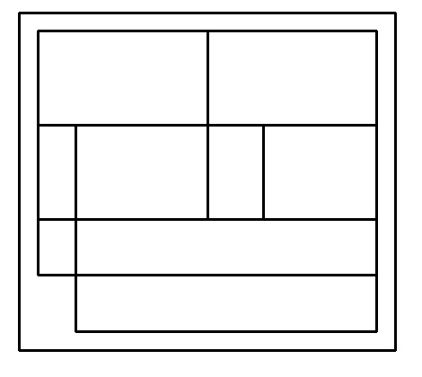
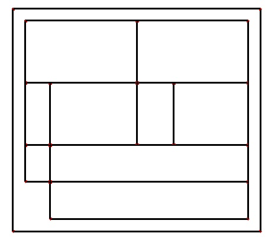

# **Corner Detection**
---

A Code on Jupyter-Notebook for **Corner Detection** on images using **Harris Corner Detection** in **OpenCV**

### **Original Image**
---

---

### **Processed Image**
---

---